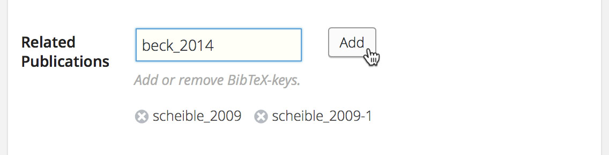
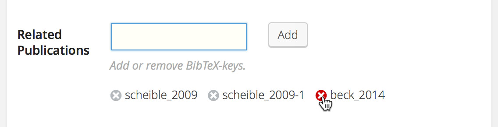
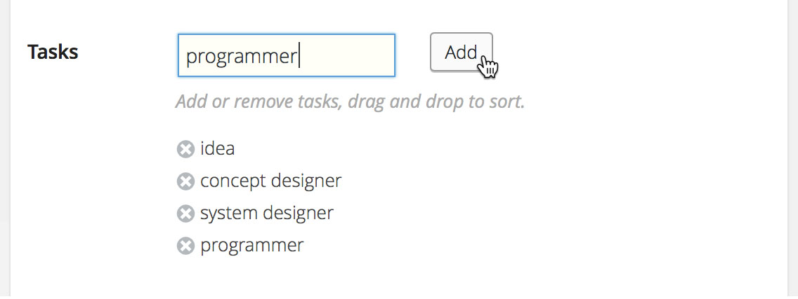
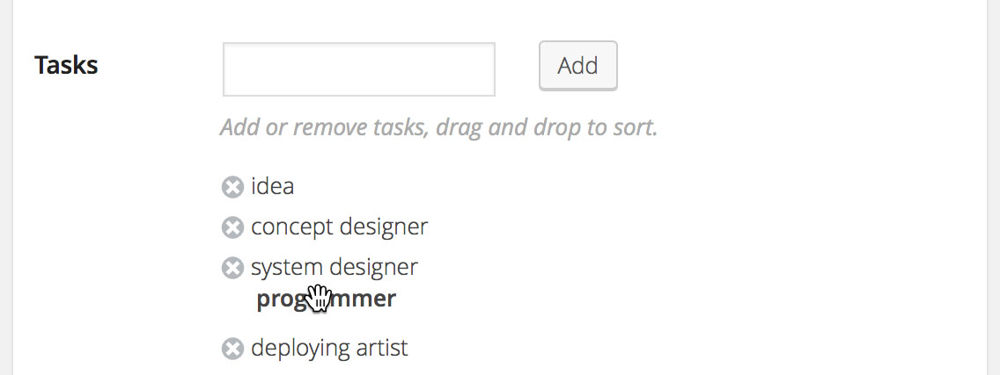

# CMB2 Field Type: Tags

**Contributors:**      [florianbeck](https://github.com/florianbeck)  
**License:** GPLv3 ([http://www.gnu.org/licenses/gpl-3.0.html](http://www.gnu.org/licenses/gpl-3.0.html))

WordPress-Tags-like field type for Custom Metaboxes and Fields for WordPress using CMB2.  

## Description
WordPress-Tags-like field type for [CMB2](https://github.com/WebDevStudios/CMB2). Based on [WordPress Tags-Like Meta Box](https://github.com/WebDevStudios/WordPress-tags-like-meta-box).

This plugin gives you two CMB2 field types:

1. The ```tags``` field acts like WordPress's default tags list.
2. The ```tags_sortable```field acts like WordPress's default tags list as well, but adds sorting.

The Entrys will be saved as single string separated with semicolons.

**Note:** This field may not support repetition, repeatable fields/groups is untested.

## Installation
You can install this field type as you would a WordPress plugin: 

1. Download the plugin.
2. Place the plugin folder in your ```wp-content/plugins/``` directory.
3. Activate the plugin in the Plugin dashboard.

Alternatively, you can place the plugin folder within your theme/plugin. After you [call CMB2](https://github.com/WebDevStudios/CMB2/wiki/Basic-Usage#getting-started), add another line to include the ```cmb2-field-tags.php``` file. Something like:

```php
require_once 'cmb2-field-type-tags/cmb2-field-type-tags.php';
```

## Usage

See [CMB2's Wiki](https://github.com/WebDevStudios/CMB2/wiki) for general information and a basic example of [how to create a metabox](https://github.com/WebDevStudios/CMB2/wiki/Basic-Usage#create-a-metabox) with CMB2.

#### Initialize the fields

1. Create a metabox.
2. Add the custom field by calling the `add_field`-function of the metabox:

```tags``` — WordPress-Tags-like input field. Example:

```php
$cmb->add_field( array(
	'name' => __( 'Related Publications', 'textdomain' ),
	'desc' => __( 'Add or remove BibTeX-keys.', 'textdomain' ),
	'id'   => $prefix . 'related_publications',
	'type' => 'tags',
) );
```

```tags_sortable``` — WordPress-Tags-like input field that allows sorting. Example:

```php
$cmb->add_field( array(
	'name' => __( 'Tasks', 'textdomain' ),
	'desc' => __( 'Add or remove tasks, drag and drop to sort.', 'textdomain' ),
	'id'   => $prefix . 'tasks',
	'type' => 'tags_sortable',
) );
```
 
#### Show in the frontent

You can get the entrys by `get_post_meta( get_the_ID(), 'prefix_tasks', true ) );`  
The entrys are stored as one single string separated with semicolons. Example:  
`idea;concept designer;system designer;programmer;deploying artist`


Generate an array. Example:
```php
$tasks = explode( ';', get_post_meta( get_the_ID(), 'prefix_tasks', true ) );
foreach ( $tasks as $task ) {
    printf('<li>%s</li>', $task);
}
```

Replace separator. Example:
```php
$tasks = str_replace(';', ', ', get_post_meta( get_the_ID(), 'prefix_tasks', true ) );
echo $tasks;
```
 
## Screenshots

### Tags box

Adding entry in tags box:


Deleting entry in tags box:


### Tags box (sortable)

Adding entry in tags_sortable box:


Sorting entry in tags_sortable box:

